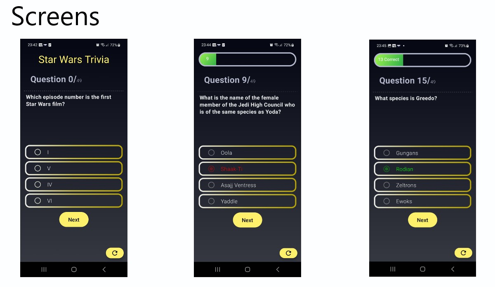

# App Android Star Wars Trivia

I've been studying JetPack Compose, a modern toolkit for building native UI on
Android apps. I simulate an API behavior through Github-pages, an API of [Star Wars
Questions](https://github.com/pgustavo73/starwars_trivia_api) has been consumed by this Trivia App.

## Objective
This app have an objective to bring more knowledge about star wars saga by a trivia game.

## Diferencial
I use retrofit to consume a JSON file with the questions and to keep the state of the Quiz
while you go away from the app a use share preference. If you want to reset the questions ?
We have a button for this.

### Tecnologias & Tools

* MVVM
* Kotlin Coroutines
* Kotlin Coroutines Flow
* Kotlin
* Retrofit
* Dagger Hilt
* Shared Preferences
* Material 3
* Jetpack Compose

### Status: Completed

